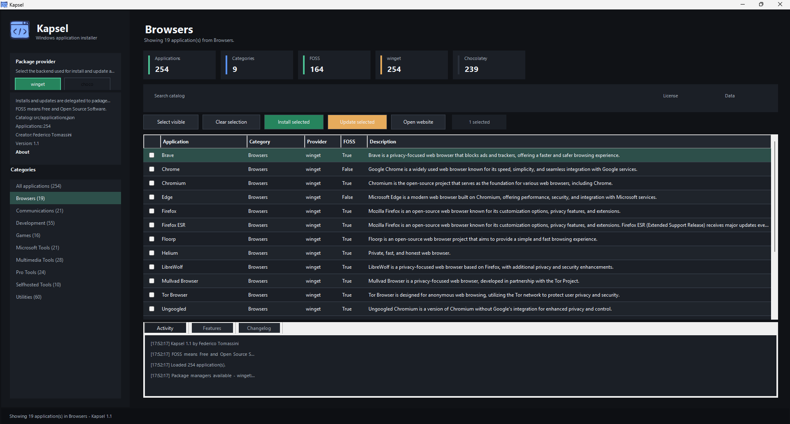

# Kapsel

<p align="center">
  
</p>

Kapsel is a native Windows Forms application written in PowerShell for installing and updating curated Windows applications from a local catalog.

It is designed as a practical package launcher: choose applications, pick a provider, confirm the action, and let `winget` or Chocolatey handle the installation.

## Overview

- Version: `1.1.5`
- Creator: Federico Tomassini
- Platform: Windows 10/11
- Runtime: PowerShell 5.1 or higher
- Catalog size: 254 applications
- Catalog source: `src/applications.json`

The name comes from `capsule`/`kapsel`: a compact container for a curated set of applications that can be installed or updated from one interface.

## Features

- Native Windows Forms interface.
- Dark, compact, utility-focused layout.
- Search by application name, key, description, `winget` id, or Chocolatey id.
- Category navigation for focused discovery.
- FOSS-only filter for open-source software.
- Multi-select install and update workflows.
- Provider selection between `winget` and Chocolatey.
- Unavailable package providers are disabled in the UI.
- Activity log, Features, and Changelog tabs.
- Official website shortcut for the selected application.

## Requirements

- Windows 10/11.
- PowerShell 5.1 or higher.
- `winget` recommended.
- Chocolatey optional.
- Pester optional for tests.

## Usage

From the project root:

```powershell
.\kapsel.ps1
```

From `cmd.exe` or Explorer:

```cmd
kapsel.cmd
```

Show version metadata:

```powershell
.\kapsel.ps1 version
```

Show CLI help:

```powershell
.\kapsel.ps1 help
```

## Installation

### Run Without Installing

Use this mode while developing or testing from a cloned repository:

```powershell
.\kapsel.ps1
```

If PowerShell blocks script execution, run Kapsel from a trusted terminal with a process-scoped execution policy:

```powershell
powershell.exe -NoProfile -ExecutionPolicy Bypass -File .\kapsel.ps1
```

On Windows, double-clicking a `.ps1` file can open it in an editor instead of running it. Use a terminal, or launch through the command wrapper:

```cmd
kapsel.cmd
```

### Install For Current User

Install the launchers into `$HOME\bin` and optionally add that directory to the user `PATH`:

```powershell
.\install.ps1 -AddToUserPath
```

The installer creates:

- `kapsel.ps1`: PowerShell launcher.
- `kapsel.cmd`: command launcher so `kapsel` works from a new terminal.

Use a custom install directory when needed:

```powershell
.\install.ps1 -InstallDirectory "$HOME\Tools\Kapsel" -AddToUserPath
```

Open a new terminal after adding the directory to `PATH`, then run:

```cmd
kapsel
```

### Package Providers

Kapsel delegates installation and update commands to external package managers:

- `winget`: recommended default provider on modern Windows.
- Chocolatey: optional fallback when installed and when the catalog entry defines a Chocolatey package id.

The UI disables unavailable providers and skips selected applications that do not define a package id for the selected provider.

## Release Builds

Kapsel can be packaged for GitHub Releases with:

```powershell
npm run build:release
```

The build creates:

- `dist/releases/Kapsel-<version>-windows/`: unpacked release directory.
- `dist/releases/Kapsel-<version>-windows.zip`: archive ready to attach to a GitHub Release.
- `Kapsel.exe`: Windows executable generated from `kapsel.ps1`.

The release archive includes the executable, script launchers, `src/`, `assets/`, and README content. Distribute the generated `.zip`, not the `.exe` alone.

## Release Automation

GitHub Actions creates releases from version tags. Update the app version, commit the change, then push a matching tag:

```powershell
git tag v1.1.5
git push origin v1.1.5
```

The release workflow validates that the tag matches `package.json`, runs validation and tests, builds the Windows release package, and publishes `Kapsel-<version>-windows.zip` to the GitHub Release.

## Catalog

The catalog lives at:

```txt
src/applications.json
```

Each entry uses this shape:

```json
{
  "category": "Utilities",
  "content": "7-Zip",
  "description": "File archiver",
  "link": "https://www.7-zip.org/",
  "winget": "7zip.7zip",
  "choco": "7zip",
  "foss": true
}
```

Field guidance:

- `category`: visible UI category.
- `content`: display name shown in the app grid.
- `description`: short user-facing description.
- `link`: official project or vendor page.
- `winget`: exact `winget` package id, or `na` when unavailable.
- `choco`: Chocolatey package id, or `na` when unavailable.
- `foss`: `true` when the application is Free and Open Source Software.

`winget` is preferred when available. Chocolatey is used only when selected in the UI and the catalog entry defines a compatible package.

## What Is FOSS

FOSS means `Free and Open Source Software`. In practice, these are applications whose source code is publicly available and can usually be studied, modified, and redistributed under their license.

The `FOSS only` filter shows catalog entries marked with:

```json
"foss": true
```

## Architecture

```txt
src/
  applications.json
  Kapsel.ps1
  modules/
    Applications.psm1
    ApplicationGrid.psm1
    ApplicationInfo.psm1
    ApplicationMain.psm1
    ApplicationSidebar.psm1
    Assets.psm1
    Branding.psm1
    Gui.psm1
    UiTheme.psm1
tests/
  Applications.Tests.ps1
```

Module responsibilities:

- `Applications.psm1`: catalog loading, filtering, package manager detection, and package command construction.
- `ApplicationGrid.psm1`: DataGridView creation, table binding, and selected application extraction.
- `ApplicationInfo.psm1`: Activity, Features, and Changelog UI section.
- `ApplicationMain.psm1`: main content layout, filters, stats, actions, and grid composition.
- `ApplicationSidebar.psm1`: brand header, provider selector, app metadata, and category navigation.
- `Assets.psm1`: internal asset path resolution.
- `Branding.psm1`: product name, version, creator, and description.
- `Gui.psm1`: composition root and event wiring.
- `UiTheme.psm1`: colors, fonts, shared controls, and custom-drawn dark UI helpers.

## Development

Common commands are exposed through `package.json`:

```powershell
npm start
npm run validate
npm test
npm run build:check
npm run build:release
```

Command purpose:

- `npm start`: opens the Kapsel UI.
- `npm run validate`: validates PowerShell syntax.
- `npm test`: runs the Pester test suite.
- `npm run build:check`: validates release packaging without compiling the executable.
- `npm run build:release`: builds the full release package with `Kapsel.exe`.
- `npm run release`: runs validation, tests, and full release packaging.

Validate PowerShell syntax:

```powershell
$files = Get-ChildItem -Recurse -Include *.ps1,*.psm1
foreach ($file in $files) {
    $tokens = $null
    $errors = $null
    [System.Management.Automation.Language.Parser]::ParseFile($file.FullName, [ref] $tokens, [ref] $errors) | Out-Null
    if ($errors.Count -gt 0) { throw "$($file.FullName): $($errors[0].Message)" }
}
```

Run tests:

```powershell
Invoke-Pester .\tests
```

Smoke-test the entrypoint:

```powershell
.\kapsel.ps1 version
```

## Contributing

Read [CONTRIBUTING.md](../CONTRIBUTING.md) before opening a pull request or issue.

Short version:

- Open an issue first for bugs, design regressions, large catalog changes, or behavior changes.
- Keep catalog entries accurate, official, and manually maintainable.
- Keep UI changes inside the existing clean module boundaries.
- Run syntax validation and Pester tests before submitting a pull request.
