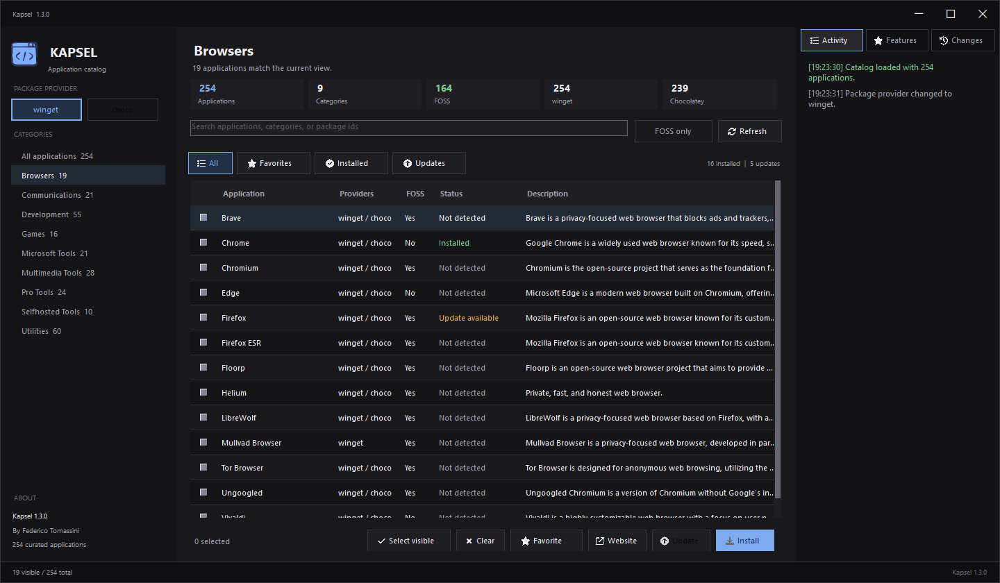

# Kapsel

<p align="center">
  
</p>

Kapsel is a native Windows application for installing and updating a curated software catalog
through `winget` or Chocolatey. It is written in PowerShell and Windows Forms, requires no web
runtime, and keeps package operations explicit and reviewable.

Version `1.3.0` adds persistent application favorites on top of responsive background operations,
visible package progress, installed-app detection, and update availability. Releases use a
script-based ZIP by default, with executable builds available as an explicit option.

[User guide](docs/USER_GUIDE.md) · [Development](docs/DEVELOPMENT.md) ·
[Contributing](CONTRIBUTING.md) · [Support](SUPPORT.md)

## What Kapsel Does

- Loads a curated catalog of Windows applications from `src/applications.json`.
- Searches by application name, key, category, description, or package identifier.
- Filters applications by category and Free and Open Source Software status.
- Saves favorite applications and provides a dedicated Favorites view across sessions.
- Preserves selections while the user searches or changes category.
- Stops queued packages without killing the active installer and retries failed apps with confirmation.
- Warns about long-running packages and labels previous inventory with its provider and scan time.
- Shows visible, hidden, and provider-supported selections before running a batch.
- Preserves the focused application, sorting, and scroll position when it remains in a refreshed view.
- Shows full descriptions, provider IDs, detected versions, and update-check confidence in Details.
- Detects installed applications and available updates for the selected provider in the background.
- Filters the catalog to installed applications or those with updates available.
- Installs or updates multiple applications after explicit confirmation.
- Runs package operations in the background with a completed-applications progress bar, an active-operation indicator, and elapsed time.
- Uses `winget` or Chocolatey only when the provider is installed and supported by the package.
- Skips unsupported selections and records the result in the activity panel.
- Opens the official website for the focused application.
- Displays product features, release changes, provider state, and operation activity in the UI.

Kapsel does not download arbitrary URLs, maintain its own package repository, or bypass package
manager security controls. `winget` and Chocolatey remain responsible for package resolution,
download, validation, installation, and updates.

## Product Journey

```txt
Open Kapsel
  -> choose a package provider
  -> find and select applications
  -> choose Install or Update
  -> review the confirmation
  -> Kapsel executes supported package commands
  -> inspect the result in Activity
```

## Interface

The desktop shell follows a compact three-pane model:

| Surface | Responsibility |
| --- | --- |
| Window bar | Application identity, window drag area, minimize, maximize, restore, and close. |
| Left navigation | Product identity, active package provider, categories, and version context. |
| Catalog workspace | Search, FOSS filtering, catalog metrics, selection, install, and update actions. |
| Inventory filters | All, Installed, and Updates views with provider-specific counts and app status. |
| Context panel | Focused-app Details, Activity, current features, and release changes. |
| Status bar | Visible catalog count and package-operation status. |

All descriptive and informational text is rendered with labels. Only controls that accept user
input, such as search and checkboxes, are editable or selectable.

| Shortcut | Action |
| --- | --- |
| `Ctrl+F` | Focus catalog search. |
| `Escape` | Clear a non-empty search. |
| `Down` in search | Apply the pending search and focus the catalog. |
| `Space` in the catalog | Toggle the focused application's selection. |
| `Ctrl+A` outside search | Select all applications in the current view. |
| `Ctrl+Shift+A` outside search | Clear all selections, including hidden applications. |
| `F5` | Refresh provider inventory. |
| `F6` / `Shift+F6` | Move between search, catalog, categories, and the Details tab button. |

## Requirements

- Windows 10 or Windows 11.
- Windows PowerShell 5.1 (`powershell.exe`), the supported and tested runtime.
- `winget` recommended.
- Chocolatey optional.
- Chocolatey 2 or newer is required for inventory; winget inventory options are checked from its help output.
- JetBrains Mono recommended; Kapsel falls back to Segoe UI when unavailable.
- Node.js 24 LTS recommended for repository tooling; the major version is recorded in `.node-version`.
- Pester 4.10.1 for local tests.

## Run Kapsel

From PowerShell:

```powershell
.\kapsel.ps1
```

From Command Prompt or Explorer:

```cmd
kapsel.cmd
```

When Windows associates `.ps1` files with an editor, use `kapsel.cmd` or run the script from a
terminal. The wrapper starts PowerShell with a process-scoped execution-policy bypass.

Available commands:

```powershell
.\kapsel.ps1 ui
.\kapsel.ps1 help
.\kapsel.ps1 version
```

Repository aliases:

```powershell
npm start
npm run dev
npm run app
npm run help
npm run version
```

`start`, `dev`, and `app` all open the local Windows Forms application through the same
repository-relative STA launcher.

## Install Launchers

Install the launchers for the current user and add their directory to the user `PATH`:

```powershell
.\install.ps1 -AddToUserPath
```

Use a custom location when required:

```powershell
.\install.ps1 -InstallDirectory "$env:USERPROFILE\Tools\Kapsel" -AddToUserPath
```

Open a new terminal after changing `PATH`, then run `kapsel`.

## Catalog Contract

Browse the complete generated list in [CATALOG.md](./CATALOG.md).

The source catalog remains at `src/applications.json` for backward compatibility and manual
maintenance. Each top-level property is a stable application key:

```json
{
  "sevenzip": {
    "category": "Utilities",
    "content": "7-Zip",
    "description": "File archiver",
    "link": "https://www.7-zip.org/",
    "winget": "7zip.7zip",
    "choco": "7zip",
    "foss": true
  }
}
```

| Field | Contract |
| --- | --- |
| Top-level key | Unique, stable identifier used to preserve selection and map UI rows. |
| `category` | User-facing category. Empty values normalize to `Uncategorized`. |
| `content` | Required display name. |
| `description` | Short factual description. |
| `link` | Official project, publisher, or product page. |
| `winget` | Exact package identifier, or `na` when unavailable. |
| `choco` | Exact Chocolatey package identifier, or `na` when unavailable. |
| `foss` | Boolean identifying Free and Open Source Software. |

The complete authoring and normalization rules are in [Catalog maintenance](docs/CATALOG.md).
Kapsel treats persisted JSON as untrusted input. The infrastructure adapter parses the document,
then the domain layer normalizes and validates every catalog entry before presentation.

## Package Workflow

Package execution has four explicit stages:

1. Presentation sends selected applications and a provider to the application service.
2. Application separates supported and unsupported entries.
3. Domain creates a structured command description without executing a process.
4. Infrastructure starts the package manager and returns its exit code.

Generated commands use exact package identifiers and non-interactive agreement flags. Kapsel never
constructs a command from a free-form user command string.

The progress bar counts completed applications (including failures), not downloaded bytes. The
animated indicator remains active while the current package runs. You can search, move, or minimize
the window during installation; another batch and closing the window are blocked until it finishes.
Activity explains each result directly, including when no newer version is available. Those
applications count as unchanged, not failed. Real failures include the provider's output in
Activity; log files in `%LOCALAPPDATA%\Kapsel\Logs` remain available as a backup.
Result classification follows the documented [winget return codes](https://github.com/microsoft/winget-cli/blob/master/doc/windows/package-manager/winget/returnCodes.md)
and [Chocolatey upgrade exit codes](https://docs.chocolatey.org/en-us/choco/commands/upgrade/#exit-codes).
Chocolatey's explicit no-update code requires its enhanced exit codes feature; otherwise its
successful console output is shown in Activity without assuming that an update was installed.
Some packages require administrator privileges; Kapsel does not automatically elevate the entire app.

Inventory results are provider-specific and refreshed when you switch provider, press Refresh, or
finish a package batch. A missing match is shown as **Not detected**, not proof that the software
is absent from Windows: winget export only includes packages it can match to a configured source.
When update lookup fails, installed state remains visible and the update check is marked unavailable.

Favorites are stored per Windows user in `%LOCALAPPDATA%\Kapsel\preferences.json`. The file uses a
versioned JSON format and is written atomically, so installing a new Kapsel release does not replace
personal preferences.
Unsupported schemas and malformed files are preserved; favorites are disabled when their file cannot
be loaded. Activity explains how to back up or move the file before resetting it. Writes also check
the existing document so a file changed after startup cannot be silently downgraded.

## Architecture

```txt
Presentation / WinForms
        |
Application use cases
        |
Domain rules and command descriptions

Composition root --------> Infrastructure adapters
        |
Shared product metadata
```

Dependency direction is enforced by tests: Domain has no UI, filesystem, or process dependency;
Application has no Presentation or Infrastructure import. The WinForms composition root is the
only place allowed to wire use cases to concrete adapters.

```txt
src/
  Kapsel.ps1
  applications.json
  modules/
    Application/
      CatalogService.psm1
      InventoryService.psm1
      PackageService.psm1
      PreferenceService.psm1
    Domain/
      ApplicationCatalog.psm1
      PackageInventory.psm1
      PackageOperation.psm1
      UserPreferences.psm1
    Infrastructure/
      AssetProvider.psm1
      JsonCatalogRepository.psm1
      JsonPreferencesRepository.psm1
      PackageManagerAdapter.psm1
      PackageInventoryAdapter.psm1
    Presentation/WinForms/
      ApplicationGridView.psm1
      CatalogView.psm1
      ContextView.psm1
      Gui.psm1
      ShellView.psm1
      SidebarView.psm1
      Theme.psm1
      WindowChrome.psm1
      InventoryRunner.psm1
      PackageOperationRunner.psm1
    Shared/
      ProductMetadata.psm1
```

Icons render locally and do not require a runtime download.

## Development

```powershell
npm run dev
npm run check
npm run validate
npm test
npm run test:ui
npm run test:ui:packages
npm run bench:catalog
npm run docs:catalog:check
npm run docs:check
npm run build:check
```

`test:ui:packages` exercises confirmation, background progress, success, and failure in the real
window using a simulated provider. It does not install or update any software.

See [Development](docs/DEVELOPMENT.md) for Pester setup and the command matrix, and
[Testing](docs/TESTING.md) for deterministic tests and interactive smoke-test requirements.

Remove generated release directories and ZIP files without touching other `dist` content:

```powershell
npm run clean:releases
```

For a full Windows release build:

```powershell
npm run build:release
```

The release build creates:

```txt
dist/releases/Kapsel-<version>-windows/
dist/releases/Kapsel-<version>-windows.zip
```

The default release is a script-based ZIP. Extract the complete archive and open `kapsel.cmd`.
Keep the adjacent `src` and `assets` directories. No executable compilation dependency is needed.

An optional unsigned executable can still be built with `npm run build:exe`; it also depends on
the adjacent directories. This is an opt-in development artifact, excluded from automated releases.
Script distribution does not provide publisher certification or guarantee that Windows security
software will allow the application.

## Release Automation

Update `package.json` and `ProductMetadata.psm1` to the same version, commit the release, then push
a matching semantic-version tag:

```powershell
git tag v1.3.0
git push origin v1.3.0
```

The Quality workflow validates source changes and pull requests. The Release workflow runs the
same checks, builds the distributable ZIP, and publishes it only from a matching version tag.
See [Releasing](docs/RELEASING.md) for the complete preparation, verification, and recovery procedure.

## Documentation

| Document | Purpose |
| --- | --- |
| [README.md](./README.md) | Product overview, setup, operation, and contributor entry point. |
| [CATALOG.md](./CATALOG.md) | Generated list of available applications and package identifiers. |
| [CHANGELOG.md](./CHANGELOG.md) | Released user-visible, architectural, catalog, and packaging changes. |
| [CONTRIBUTING.md](./CONTRIBUTING.md) | Issue, catalog, branch, commit, and pull-request workflow. |
| [docs/README.md](./docs/README.md) | Documentation index for users, contributors, and maintainers. |
| [SUPPORT.md](./SUPPORT.md) | Troubleshooting entry point and issue diagnostics. |

## Project Status

`v1.3.0` adds persistent favorites while retaining reliable package execution, inventory visibility, and Activity reporting. Kapsel remains focused on one job:
making a curated Windows application catalog easy to search, install, and update from one native
interface.

Read [CONTRIBUTING.md](./CONTRIBUTING.md) before opening an issue or pull request.

## License

Kapsel is licensed under the [MIT License](LICENSE).
